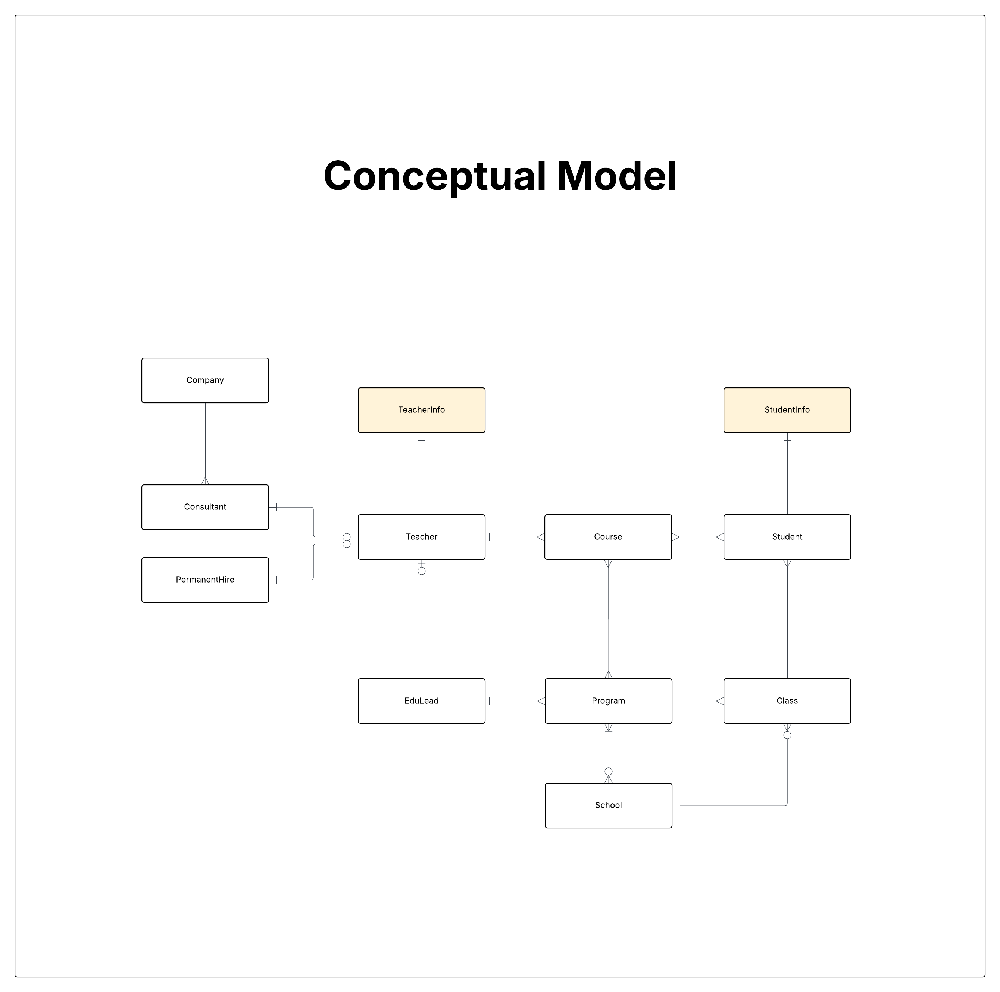

# Conceptual Data Model

## Overview
This is the high-level conceptual model for YrkesCo's educational platform, showing the main entities and their relationships without technical implementation details.

## Entities
- Student
- Student Info
- Class
- Program
- Course
- Teacher
- Teacher Info
- School
- Company
- Consultant
- Permanent Hire
- Educational Lead

## Key Relationships

### STUDENT RELATIONSHIPS

### Student - Class (M:1)
- A Student belongs to one and only one Class
- A Class has one or more Students

### Student - StudentInfo (1:1)
- A Student has one and only one StudentInfo (has sensitive information)
- A StudentInfo (sensitive information) belongs to one and only one Student

### Student - Course (M:M)
- A Course can be taken by zero or more  Students
- A Student can register for zero or more Courses

### COURSE RELATIONSHIPS

### Course - Program (M:M)
- A Course can be part of zero or more Programs
- A Program consists of one or more Courses

### Course - Teacher (M:1)
- A Course is taught by one Teacher
- A Teacher can teach many Courses

### CLASS RELATIONSHIPS

### Class - Program (M:1)
- A Class belongs to one and only one Program
- A Program has one or more Classes (3 classes per cohort, multiple cohorts)

### Class - School (M:1)
- A Class is heald at one and only one School
- A School has zero or more Classes

### PROGRAM RELATIONSHIPS

### Program - School (M:M)
- A Program is offered at one or more Schools
- A School offers zero or more Programs

### Program - Educational Lead (M:1)
- A Program is managed by only one Educational Lead
- An EducationalLead manages one or more Programs

### TEACHER RELATIONSHIPS

### Teacher - Permanent Hire (0..1:1)
- A Teacher can have zero or one PermanentHire contract
- A PermanentHire contract belongs to one and only one Teacher

### Teacher - Teacher Info (1:1)
- A Teacher has one and only one TeacherInfo (has sensitive information)
- A TeacherInfo (sensitive information) belongs to one and only one Teacher

### Teacher - Educational Lead (0..1:1)
- A Teacher can have zero or one EducationalLeader role
- An EducationalLeader role is held by one and only one Teacher

### CONSULTANT RELATIONSHIPS

### Consultant - Company (M:1)
- A Consultant works for one and only one Company
- A Company can have zero or one Consultants

### Consultant - Teacher (0..1:1)
- A Consultant contract belongs to one and only one Teacher
- A Teacher can have zero or one Consultant contract
- Note: A Teacher can be EITHER Consultant OR PermanentHire, not both

## Conceptual ERD

